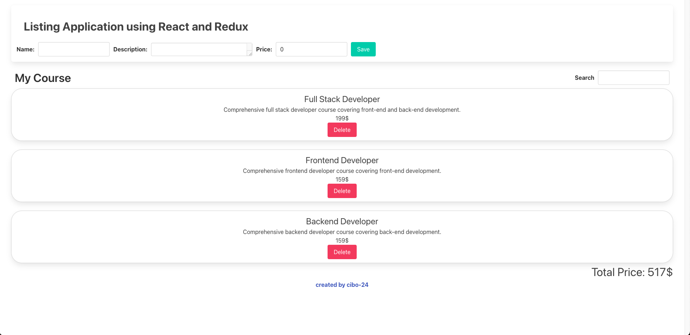

# Listing-Application-using-React-and-Redux
Listing application with React and Redux

I used React and Redux in this application. I used bulma.io for CSS.
I created a main control section with store in the project. Here my slices are under control.
In the slice, there are state updates and methods. You can also search the list with the search button.

-Project İmages

